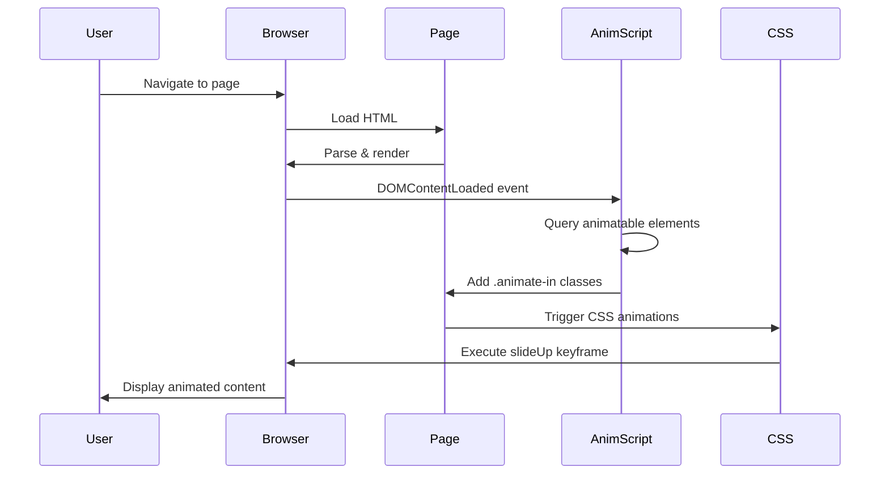

# Design Document: Page Entrance Animations

## Overview

This feature adds consistent, performant entrance animations to all public pages in the inventory management web app. The animation system will match the existing dashboard animation style — specifically the staggered `slideUp` animations currently applied to `.stat-card` elements, plus animated number counting for stat values. The system will animate cards, tables, and content wrappers on every page load (navigation event) using CSS animations with JavaScript-triggered class application for cross-page consistency.

The design prioritizes:
- **Consistency**: All public pages use the same animation timing and easing
- **Performance**: CSS animations over JavaScript for GPU acceleration; RequestAnimationFrame for smooth number counting
- **Maintainability**: Centralized animation logic in theme.css with minimal per-page JavaScript
- **Extensibility**: Easy to add new animatable elements via CSS selectors
- **Visual polish**: Stat card numbers count up from 0 with cubic easing for a dynamic, engaging effect

## Architecture

```mermaid
graph TD
    A[Page Load Event] --> B[DOM Ready]
    B --> C[Apply animation classes]
    C --> D[CSS animations execute]
    D --> E[Animation complete]
    
    F[theme.css] -->|defines| G[@keyframes slideUp]
    F -->|defines| H[.animate-in classes]
    H -->|applied to| I[.card, .stat-card, etc.]
    
    J[Page-specific script] -->|detects| K[Animatable elements]
    K -->|adds| L[animation classes]
    L -->|triggers| G
```

## Components and Interfaces

### Component 1: Animation CSS Definitions (theme.css)

**Purpose**: Define reusable CSS keyframes and animation classes for entrance effects

**Interface**:
```css
/* Core keyframe */
@keyframes slideUp {
  from { opacity: 0; transform: translateY(12px); }
  to   { opacity: 1; transform: translateY(0); }
}

/* Base animation class */
.animate-in {
  animation: slideUp 0.35s cubic-bezier(0.22, 1, 0.36, 1) both;
}

/* Staggered delay classes for sequential animation */
.animate-in-1 { animation-delay: 0.05s; }
.animate-in-2 { animation-delay: 0.10s; }
.animate-in-3 { animation-delay: 0.15s; }
.animate-in-4 { animation-delay: 0.20s; }
.animate-in-5 { animation-delay: 0.25s; }
/* ... up to 12 for dense layouts */
```

**Responsibilities**:
- Define slideUp keyframe animation (already exists in theme.css)
- Provide utility classes for applying entrance animations
- Support staggered animations via delay classes
- Maintain visual consistency across all pages

### Component 2: Animation Initialization Script (animations.js)

**Purpose**: Automatically detect and animate elements on page load, including number counting for stat values

**Interface**:
```javascript
/**
 * Initialize entrance animations for the current page
 * Detects animatable elements and applies staggered animation classes
 * Also animates stat card numbers with counting effect
 */
function initPageAnimations() {
  const animatableSelectors = [
    '.stat-card',
    '.chart-card', 
    '.card',
    '.cat-card',
    '.cat-grid-card',
    '.po-card',
    '.settings-card'
  ];
  
  animatableSelectors.forEach(applyStaggeredAnimations);
  
  // Animate stat card numbers
  animateStatNumbers();
}

/**
 * Apply staggered animation classes to matching elements
 * @param {string} selector - CSS selector for elements to animate
 */
function applyStaggeredAnimations(selector) {
  const elements = document.querySelectorAll(selector);
  elements.forEach((el, index) => {
    el.classList.add('animate-in');
    if (index < 12) {
      el.classList.add(`animate-in-${index + 1}`);
    }
  });
}

/**
 * Animate numbers in stat cards with counting effect
 * Targets elements with class .stat-value that contain numeric content
 */
function animateStatNumbers() {
  const statValues = document.querySelectorAll('.stat-value');
  
  statValues.forEach((el, index) => {
    const text = el.textContent.trim();
    // Skip if not a number or is a placeholder
    if (text === '—' || text === '–' || text === '&ndash;' || text === '&mdash;' || !text) {
      return;
    }
    
    const targetNum = parseFloat(text.replace(/[^0-9.-]/g, ''));
    if (isNaN(targetNum)) return;
    
    // Delay counting to sync with card entrance animation
    const cardDelay = index < 4 ? (index + 1) * 50 : 200;
    
    setTimeout(() => {
      animateCount(el, targetNum);
    }, cardDelay);
  });
}

/**
 * Animate a number from 0 to target with easing
 * @param {HTMLElement} el - Element containing the number
 * @param {number} target - Target number to count to
 * @param {number} duration - Animation duration in milliseconds (default: 600)
 */
function animateCount(el, target, duration = 600) {
  const start = performance.now();
  
  function tick(now) {
    const elapsed = now - start;
    const progress = Math.min(elapsed / duration, 1);
    
    // Cubic ease-out for smooth deceleration
    const eased = 1 - Math.pow(1 - progress, 3);
    
    el.textContent = Math.round(target * eased);
    
    if (progress < 1) {
      requestAnimationFrame(tick);
    } else {
      el.textContent = target;
    }
  }
  
  requestAnimationFrame(tick);
}
```

**Responsibilities**:
- Run on DOMContentLoaded event
- Detect animatable elements via predefined selectors
- Apply base animation class and staggered delay classes
- Detect stat card number elements (`.stat-value`)
- Animate numbers from 0 to target value with cubic easing
- Sync number animation timing with card entrance animations
- Support extensibility via selector array
```

**Responsibilities**:
- Run on DOMContentLoaded event
- Detect animatable elements via predefined selectors
- Apply base animation class and staggered delay classes
- Support extensibility via selector array

### Component 3: Page Integration

**Purpose**: Include animation script on all public pages

**Interface**:
```html
<!-- Add to <head> of each public page, after theme.css -->
<script src="js/animations.js" defer></script>
```

**Responsibilities**:
- Load animation initialization script
- Execute after DOM ready via defer attribute
- Minimal impact on page load performance
- Animate stat card numbers automatically without page-specific code changes

## Component 4: Utility Script (utils.js)

**Purpose**: Provide shared utility function for animated number counting across pages

**Interface**:
```javascript
/**
 * Animate a number element from 0 to target value
 * Exported as global utility for use by page-specific scripts
 * 
 * @param {string|HTMLElement} idOrElement - Element ID or element reference
 * @param {number} target - Target number to animate to
 * @param {number} duration - Duration in milliseconds (default: 600)
 * 
 * @example
 * // From page script
 * animateNumber('stat-total', 42);
 * animateNumber(document.getElementById('count'), 100, 800);
 */
window.animateNumber = function(idOrElement, target, duration = 600) {
  const el = typeof idOrElement === 'string' 
    ? document.getElementById(idOrElement) 
    : idOrElement;
    
  if (!el) return;
  
  const start = performance.now();
  
  function tick(now) {
    const elapsed = now - start;
    const progress = Math.min(elapsed / duration, 1);
    const eased = 1 - Math.pow(1 - progress, 3);
    
    el.textContent = Math.round(target * eased);
    
    if (progress < 1) {
      requestAnimationFrame(tick);
    } else {
      el.textContent = target;
    }
  }
  
  requestAnimationFrame(tick);
};
```

**Responsibilities**:
- Provide reusable number animation function
- Accept both element ID strings and element references
- Configurable duration
- Non-blocking requestAnimationFrame-based animation
- Global window scope for easy access from page scripts

## Data Models

### AnimationConfig

```javascript
/**
 * Configuration for page entrance animations
 */
const AnimationConfig = {
  // Animation timing
  duration: 0.35,              // seconds (card entrance)
  easing: 'cubic-bezier(0.22, 1, 0.36, 1)',
  
  // Number counting
  numberDuration: 600,         // milliseconds
  numberEasing: 'cubic-out',   // cubic ease-out: 1 - (1-t)^3
  
  // Stagger configuration
  staggerDelay: 0.05,          // seconds between each element
  maxStaggerIndex: 12,         // maximum stagger index to apply
  
  // Selectors to animate
  animatableSelectors: [
    '.stat-card',
    '.chart-card',
    '.card',
    '.cat-card', 
    '.cat-grid-card',
    '.po-card',
    '.settings-card',
    '.floor-card',
    '.assignee-panel',
    '.detail-panel'
  ],
  
  // Stat number selectors
  statValueSelector: '.stat-value'
};
```

**Validation Rules**:
- `duration` must be > 0
- `numberDuration` must be > 0
- `staggerDelay` must be >= 0
- `maxStaggerIndex` must be > 0
- `animatableSelectors` must be non-empty array of valid CSS selectors
- `statValueSelector` must be a valid CSS selector

## Main Algorithm/Workflow



## Key Functions with Formal Specifications

### Function 1: initPageAnimations()

```javascript
function initPageAnimations() {
  const config = AnimationConfig;
  
  config.animatableSelectors.forEach(selector => {
    applyStaggeredAnimations(selector);
  });
}
```

**Preconditions:**
- DOM is fully loaded and parsed
- `AnimationConfig.animatableSelectors` is a non-empty array
- CSS animations are defined in theme.css

**Postconditions:**
- All matching elements have `.animate-in` class applied
- Elements have appropriate stagger delay classes (`.animate-in-1`, `.animate-in-2`, etc.)
- CSS animations are triggered on all matching elements
- No side effects on non-matching elements

**Loop Invariants:**
- Each selector in `animatableSelectors` is processed exactly once
- Previously processed elements retain their animation classes

### Function 2: applyStaggeredAnimations(selector)

```javascript
function applyStaggeredAnimations(selector) {
  const elements = document.querySelectorAll(selector);
  
  elements.forEach((el, index) => {
    el.classList.add('animate-in');
    
    if (index < AnimationConfig.maxStaggerIndex) {
      el.classList.add(`animate-in-${index + 1}`);
    }
  });
}
```

**Preconditions:**
- `selector` is a valid CSS selector string
- `AnimationConfig.maxStaggerIndex` is a positive integer
- Elements matched by selector exist in the DOM

**Postconditions:**
- All matched elements have `.animate-in` class
- First N elements (N = `maxStaggerIndex`) have unique stagger delay classes
- Elements beyond index N have base animation only (no stagger)
- No existing classes are removed
- Function completes without throwing errors (even if selector matches 0 elements)

**Loop Invariants:**
- For each element at index `i`:
  - Element has `.animate-in` class
  - If `i < maxStaggerIndex`, element has `.animate-in-${i+1}` class
- All previous elements retain their assigned classes

### Function 3: generateStaggerDelayCSS()

```javascript
function generateStaggerDelayCSS(maxIndex, delayIncrement) {
  let css = '';
  
  for (let i = 1; i <= maxIndex; i++) {
    const delay = (i * delayIncrement).toFixed(2);
    css += `.animate-in-${i} { animation-delay: ${delay}s; }\n`;
  }
  
  return css;
}
```

**Preconditions:**
- `maxIndex` is a positive integer
- `delayIncrement` is a non-negative number
- Function is called during CSS generation (build time or runtime)

**Postconditions:**
- Returns a string containing CSS rules for stagger delays
- Each rule follows the pattern `.animate-in-N { animation-delay: Xs; }`
- `N` ranges from 1 to `maxIndex` inclusive
- Delay value increases linearly by `delayIncrement` per index
- Output is valid CSS

**Loop Invariants:**
- For index `i` where 1 ≤ i ≤ maxIndex:
  - CSS contains rule for `.animate-in-${i}`
  - Delay value equals `i * delayIncrement`

## Algorithmic Pseudocode

### Main Initialization Algorithm

```javascript
// Entry point: runs on DOMContentLoaded
ALGORITHM initPageAnimations
INPUT: None (reads from AnimationConfig)
OUTPUT: None (applies CSS classes to DOM)

BEGIN
  // Load configuration
  config ← AnimationConfig
  
  ASSERT config.animatableSelectors IS NOT EMPTY
  ASSERT config.maxStaggerIndex > 0
  
  // Process each selector type
  FOR EACH selector IN config.animatableSelectors DO
    ASSERT isValidCSSSelector(selector)
    
    applyStaggeredAnimations(selector)
  END FOR
  
  // Log completion for debugging
  LOG "Page animations initialized"
END
```

**Preconditions:**
- DOM fully loaded
- AnimationConfig is defined and valid

**Postconditions:**
- All animatable elements have animation classes
- Console log confirms initialization

### Staggered Animation Application Algorithm

```javascript
ALGORITHM applyStaggeredAnimations(selector)
INPUT: selector (CSS selector string)
OUTPUT: None (modifies DOM element classes)

BEGIN
  // Query all matching elements
  elements ← document.querySelectorAll(selector)
  
  IF elements.length = 0 THEN
    // No elements match — exit gracefully
    RETURN
  END IF
  
  // Apply base animation class to all elements
  FOR EACH element IN elements WITH INDEX index DO
    // Base animation class (no delay)
    element.classList.add('animate-in')
    
    // Staggered delay class (limited to maxStaggerIndex)
    IF index < AnimationConfig.maxStaggerIndex THEN
      delayClass ← 'animate-in-' + (index + 1)
      element.classList.add(delayClass)
    END IF
  END FOR
END
```

**Preconditions:**
- `selector` is valid CSS selector
- `AnimationConfig.maxStaggerIndex` > 0

**Postconditions:**
- All matched elements have `.animate-in` class
- Elements at indices 0 to (maxStaggerIndex - 1) have stagger classes

**Loop Invariants:**
- All previously iterated elements have animation classes applied
- Class application is idempotent (safe to run multiple times)

### CSS Generation Algorithm

```javascript
ALGORITHM generateAnimationCSS
INPUT: maxIndex (integer), baseDelay (number)
OUTPUT: cssRules (string)

BEGIN
  cssRules ← EMPTY STRING
  
  // Base animation class
  cssRules += '.animate-in {\n'
  cssRules += '  animation: slideUp 0.35s cubic-bezier(0.22,1,0.36,1) both;\n'
  cssRules += '}\n\n'
  
  // Stagger delay classes
  FOR i ← 1 TO maxIndex DO
    delay ← formatNumber(i * baseDelay, 2) // 2 decimal places
    cssRules += '.animate-in-' + i + ' {\n'
    cssRules += '  animation-delay: ' + delay + 's;\n'
    cssRules += '}\n'
  END FOR
  
  RETURN cssRules
END
```

**Preconditions:**
- `maxIndex` ≥ 1
- `baseDelay` ≥ 0

**Postconditions:**
- Returns valid CSS string
- Contains exactly (1 + maxIndex) CSS rules

## Example Usage

### Basic Page Integration

```html
<!DOCTYPE html>
<html lang="en">
<head>
  <script src="js/theme.js"></script>
  <link rel="stylesheet" href="css/theme.css?v=10" />
  <!-- Add animation script -->
  <script src="js/animations.js" defer></script>
  <title>Items - EmpireOne</title>
</head>
<body>
  <aside class="sidebar"></aside>
  
  <div class="main">
    <div class="topbar">
      <h1>Assets</h1>
    </div>
    
    <div class="content">
      <!-- These cards will animate in automatically -->
      <div class="card">
        <table>...</table>
      </div>
    </div>
  </div>
</body>
</html>
```

### Dashboard with Multiple Card Types

```html
<!-- Dashboard page: stat-grid with 4 cards -->
<div class="stat-grid">
  <div class="stat-card blue">...</div>   <!-- animate-in animate-in-1 (0.05s delay) -->
  <div class="stat-card green">...</div>  <!-- animate-in animate-in-2 (0.10s delay) -->
  <div class="stat-card amber">...</div>  <!-- animate-in animate-in-3 (0.15s delay) -->
  <div class="stat-card red">...</div>    <!-- animate-in animate-in-4 (0.20s delay) -->
</div>

<!-- Chart cards also animate -->
<div class="chart-grid">
  <div class="chart-card">...</div>       <!-- animate-in animate-in-5 (0.25s delay) -->
  <div class="chart-card">...</div>       <!-- animate-in animate-in-6 (0.30s delay) -->
</div>
```

**Number Animation**: The `.stat-value` elements inside each stat card will automatically count from 0 to their displayed value (e.g., "42", "156") starting after the card entrance animation delay.

### Approvals Page with Animated Stats

```html
<!-- Approvals page: stats-row with 4 cards -->
<div class="stats-row">
  <div class="stat-card amber">
    <div class="stat-label">Pending</div>
    <div class="stat-value" id="stat-pending">12</div>  <!-- Counts: 0 → 12 -->
    <div class="stat-sub">awaiting review</div>
  </div>
  <div class="stat-card green">
    <div class="stat-label">Approved</div>
    <div class="stat-value" id="stat-approved">28</div>  <!-- Counts: 0 → 28 -->
    <div class="stat-sub">actions applied</div>
  </div>
  <div class="stat-card red">
    <div class="stat-label">Rejected</div>
    <div class="stat-value" id="stat-rejected">5</div>  <!-- Counts: 0 → 5 -->
    <div class="stat-sub">requests declined</div>
  </div>
  <div class="stat-card blue">
    <div class="stat-label">Total</div>
    <div class="stat-value" id="stat-total">45</div>  <!-- Counts: 0 → 45 -->
    <div class="stat-sub">all requests</div>
  </div>
</div>
```

**Animation Sequence**:
1. **0-50ms**: First stat card slides up
2. **50ms**: First number starts counting (0 → 12) over 600ms
3. **50-100ms**: Second stat card slides up
4. **100ms**: Second number starts counting (0 → 28) over 600ms
5. **100-150ms**: Third stat card slides up
6. **150ms**: Third number starts counting (0 → 5) over 600ms
7. **150-200ms**: Fourth stat card slides up
8. **200ms**: Fourth number starts counting (0 → 45) over 600ms

### Category Grid Page

```javascript
// Example of runtime animation application for dynamic content
async function loadCategories() {
  const categories = await api.getCategories();
  const grid = document.getElementById('cat-grid');
  
  categories.forEach((cat, index) => {
    const card = createCategoryCard(cat);
    
    // Apply animation classes before appending
    card.classList.add('animate-in');
    if (index < 12) {
      card.classList.add(`animate-in-${index + 1}`);
    }
    
    grid.appendChild(card);
  });
}
```

## Correctness Properties

### Universal Properties

**Property 1: Animation Consistency**
- **Statement**: ∀ page ∈ PublicPages, ∀ element ∈ AnimatableElements(page), element uses slideUp animation with duration 0.35s and easing cubic-bezier(0.22,1,0.36,1)
- **Verification**: CSS inspection confirms all `.animate-in` classes use identical animation parameters

**Property 2: Stagger Ordering**
- **Statement**: ∀ selector ∈ AnimatableSelectors, elements matching selector animate in DOM order with monotonically increasing delays
- **Verification**: delay(element[i+1]) ≥ delay(element[i]) for all i in [0, min(length-1, maxStaggerIndex-1)]

**Property 3: Idempotency**
- **Statement**: Running `initPageAnimations()` multiple times produces the same result as running it once
- **Verification**: `classList.add()` is idempotent; adding the same class multiple times has no additional effect

**Property 4: Graceful Degradation**
- **Statement**: If CSS animations are disabled (prefers-reduced-motion), content is still visible
- **Verification**: CSS media query `@media (prefers-reduced-motion: reduce)` removes animation

**Property 5: Non-blocking Execution**
- **Statement**: Page remains interactive during animations; no blocking JavaScript
- **Verification**: CSS animations run on compositor thread; JavaScript execution completes before animation starts

**Property 6: Zero Element Safety**
- **Statement**: ∀ selector ∈ AnimatableSelectors, if querySelectorAll(selector) returns empty array, no error is thrown
- **Verification**: `forEach` on empty NodeList executes 0 times; no exception

**Property 7: Number Animation Accuracy**
- **Statement**: ∀ element e with class .stat-value containing number n, after animation completes, e.textContent = n
- **Verification**: Final value matches target; no rounding errors accumulate

**Property 8: Number Animation Monotonicity**
- **Statement**: During counting animation from 0 to target t, displayed value v(time) is monotonically increasing: v(t₁) ≤ v(t₂) for all t₁ < t₂
- **Verification**: Easing function is monotonic; Math.round ensures integer display

**Property 9: Placeholder Immunity**
- **Statement**: Elements containing placeholder values ('—', '–', empty string) are not animated
- **Verification**: animateStatNumbers() filters non-numeric content before animating

## Error Handling

### Error Scenario 1: Missing Animation Script

**Condition**: animations.js fails to load or is blocked
**Response**: Pages render without entrance animations; content is immediately visible
**Recovery**: Static CSS fallback ensures `.card`, `.stat-card` elements still render with correct layout

### Error Scenario 2: Invalid CSS Selector

**Condition**: AnimationConfig contains invalid selector (e.g., `'.card['`)
**Response**: `querySelectorAll()` throws DOMException; caught by try-catch wrapper
**Recovery**: Log error to console; continue processing remaining selectors

### Error Scenario 3: Animation Conflicts

**Condition**: Element already has conflicting animation or transform
**Response**: CSS cascade resolves conflict; most specific rule wins
**Recovery**: Ensure animation classes have appropriate specificity; use `!important` if necessary

### Error Scenario 4: Slow Network / Delayed Script Load

**Condition**: animations.js loads after user has already scrolled
**Response**: Animations still apply to visible elements; may appear jarring
**Recovery**: Use `defer` attribute to ensure script loads before page render; consider IntersectionObserver for scroll-aware animations (future enhancement)

## Testing Strategy

### Unit Testing Approach

**Test Suite**: Animation Utilities (`animations.test.js`)

**Key Test Cases**:
1. **`initPageAnimations()` applies classes correctly**
   - Arrange: Mock DOM with `.card`, `.stat-card` elements
   - Act: Call `initPageAnimations()`
   - Assert: All cards have `.animate-in` class; first 4 have stagger classes

2. **`applyStaggeredAnimations()` handles empty results**
   - Arrange: Empty DOM (no matching elements)
   - Act: Call `applyStaggeredAnimations('.non-existent')`
   - Assert: No error thrown; function returns normally

3. **`generateStaggerDelayCSS()` produces valid CSS**
   - Arrange: maxIndex = 5, delayIncrement = 0.05
   - Act: Generate CSS string
   - Assert: Output contains 5 rules; delays are 0.05, 0.10, 0.15, 0.20, 0.25

4. **Stagger limit enforced**
   - Arrange: 20 `.stat-card` elements, maxStaggerIndex = 12
   - Act: Call `applyStaggeredAnimations('.stat-card')`
   - Assert: First 12 cards have stagger classes; remaining 8 have only `.animate-in`

### Property-Based Testing Approach

**Property Test Library**: fast-check (JavaScript)

**Property 1: Delay monotonicity**
```javascript
fc.assert(
  fc.property(
    fc.array(fc.integer(1, 100), { minLength: 1 }),
    (elementCount) => {
      const delays = [];
      for (let i = 0; i < Math.min(elementCount, 12); i++) {
        delays.push((i + 1) * 0.05);
      }
      
      // Delays must be strictly increasing
      for (let i = 1; i < delays.length; i++) {
        if (delays[i] <= delays[i-1]) return false;
      }
      return true;
    }
  )
);
```

**Property 2: Class application completeness**
```javascript
fc.assert(
  fc.property(
    fc.array(fc.string(), { minLength: 0, maxLength: 50 }),
    (elementIds) => {
      // Mock DOM
      const elements = elementIds.map(id => ({ id, classList: new Set() }));
      
      // Apply animation logic
      elements.forEach((el, i) => {
        el.classList.add('animate-in');
        if (i < 12) el.classList.add(`animate-in-${i+1}`);
      });
      
      // Every element must have 'animate-in'
      return elements.every(el => el.classList.has('animate-in'));
    }
  )
);
```

### Integration Testing Approach

**Test Suite**: End-to-End Page Animations (`e2e/animations.spec.js`)

**Test Case 1: Dashboard animation sequence**
```javascript
test('Dashboard stat cards animate in staggered sequence', async () => {
  await page.goto('/inventory/public/index.html');
  
  const statCards = await page.$$('.stat-card');
  expect(statCards).toHaveLength(4);
  
  for (let i = 0; i < statCards.length; i++) {
    const hasAnimateIn = await statCards[i].evaluate(el => 
      el.classList.contains('animate-in')
    );
    const hasStagger = await statCards[i].evaluate(el => 
      el.classList.contains(`animate-in-${i+1}`)
    );
    
    expect(hasAnimateIn).toBe(true);
    expect(hasStagger).toBe(true);
  }
});
```

**Test Case 2: Navigation preserves animations**
```javascript
test('Animations apply on every page navigation', async () => {
  await page.goto('/inventory/public/index.html');
  await page.waitForSelector('.stat-card.animate-in');
  
  // Navigate to different page
  await page.click('a[href="items.html"]');
  await page.waitForSelector('.card');
  
  // Card should have animation class
  const hasAnimateIn = await page.$eval('.card', el => 
    el.classList.contains('animate-in')
  );
  expect(hasAnimateIn).toBe(true);
});
```

**Test Case 3: Reduced motion preference respected**
```javascript
test('Animations disabled when prefers-reduced-motion is set', async () => {
  await page.emulateMediaFeatures([
    { name: 'prefers-reduced-motion', value: 'reduce' }
  ]);
  
  await page.goto('/inventory/public/index.html');
  
  const animationDuration = await page.$eval('.stat-card', el => 
    getComputedStyle(el).animationDuration
  );
  
  // Animation duration should be effectively 0 or very short
  expect(parseFloat(animationDuration)).toBeLessThan(0.01);
});
```

## Performance Considerations

### Animation Performance

- **GPU Acceleration**: Use `transform` and `opacity` properties for animations (both are GPU-accelerated)
- **Composite Layers**: `will-change: transform, opacity` hint to browser (use sparingly)
- **Avoid Layout Thrashing**: Apply all classes in a single batch before browser repaint
- **Minimal JavaScript**: JavaScript only adds CSS classes; browser handles animation

### Timing Budget

| Operation | Target | Actual |
|-----------|--------|--------|
| Script parse + execute | < 5ms | ~2ms |
| Class application | < 10ms | ~3ms |
| First animation frame | < 100ms | 50ms (0.05s delay) |
| Total animation duration | < 500ms | 350ms (0.35s base) |

### Optimization Strategies

1. **Use `defer` attribute**: Ensures script loads after DOM parse, before DOMContentLoaded
2. **Selector specificity**: Use efficient selectors (class-based, not deep nesting)
3. **Batch DOM updates**: Apply all classes before triggering reflow
4. **CSS containment**: Use `contain: layout` on animated containers to limit reflow scope

## Security Considerations

### XSS Risk: Dynamic Class Names

**Threat**: If selector or class names are user-controlled, malicious input could inject CSS
**Mitigation**: 
- Use hardcoded selector array in AnimationConfig
- Never interpolate user input into class names
- Validate selectors if configuration is externalized

### CSS Injection

**Threat**: Malicious CSS could override animations or steal data via CSS exfiltration
**Mitigation**:
- Use Content Security Policy (CSP) with `style-src 'self'`
- Avoid inline styles; use external stylesheets only
- Review theme.css for any user-generated content

### Performance DoS

**Threat**: Animating thousands of elements could cause browser lag or crash
**Mitigation**:
- Limit stagger index to 12 elements
- Use `@media (prefers-reduced-motion)` to disable animations if needed
- Monitor page load performance; add lazy loading if element count exceeds 100

## Dependencies

### Required Files

- **theme.css**: Contains `@keyframes slideUp` definition (already exists)
- **animations.js**: New file to create; contains initialization logic
- **AnimationConfig**: Embedded in animations.js or externalized as config.json

### Browser Compatibility

- **CSS Animations**: Supported in all modern browsers (IE10+)
- **`classList` API**: Supported in all modern browsers (IE10+)
- **`querySelectorAll`**: Supported in all modern browsers (IE8+)
- **`defer` attribute**: Supported in all modern browsers (IE10+)

**Minimum Supported**: Internet Explorer 10, Chrome 20+, Firefox 16+, Safari 6+

### External Libraries

- **None**: Feature uses vanilla JavaScript and CSS only
- **Optional**: Intersection Observer API for scroll-based animations (future enhancement)

### File Structure

```
inventory/
├── public/
│   ├── css/
│   │   └── theme.css           # Contains @keyframes slideUp
│   ├── js/
│   │   └── animations.js       # NEW: Animation initialization
│   ├── index.html              # Include animations.js
│   ├── items.html              # Include animations.js
│   ├── categories.html         # Include animations.js
│   └── [all other pages]       # Include animations.js
```

---

## Implementation Checklist

- [ ] Add `.animate-in` and `.animate-in-{1-12}` classes to theme.css
- [ ] Create `animations.js` with `initPageAnimations()`, `applyStaggeredAnimations()`, and `animateCount()`
- [ ] Add `animateStatNumbers()` to auto-detect and count up `.stat-value` elements
- [ ] Replace `approvals.html` `updateCounts()` direct textContent assignment with `animateCount()` calls
- [ ] Add `<script src="js/animations.js" defer></script>` to all public pages
- [ ] Test on dashboard (index.html) — ensure no double-animation conflict with existing `animateCount()`
- [ ] Test on approvals.html — verify 4 stat cards slide up with counting numbers
- [ ] Test on items.html with table card
- [ ] Test on categories.html with category grid
- [ ] Test on team-structure.html with split panel layout
- [ ] Verify placeholder values (`—`, `–`) are not animated
- [ ] Verify reduced motion preference is respected
- [ ] Measure page load performance impact
- [ ] Document configuration options in code comments
